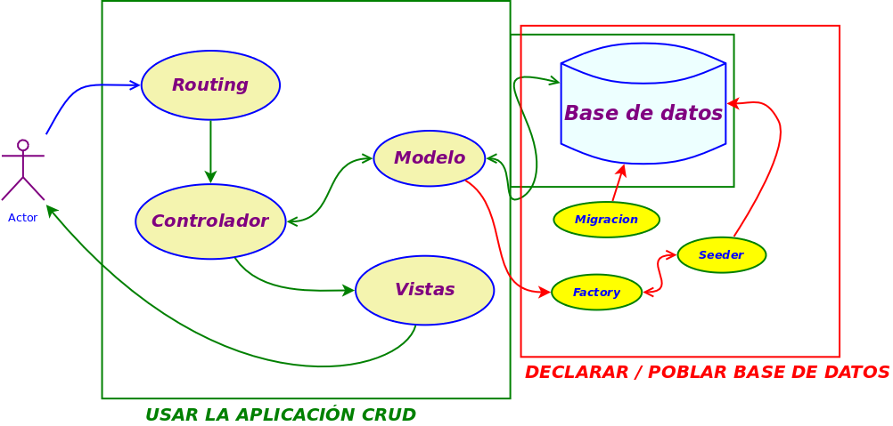
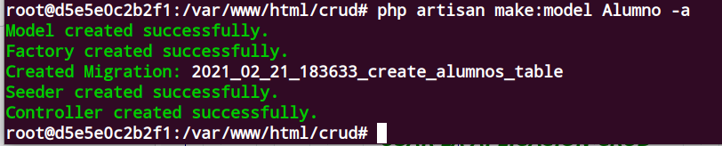
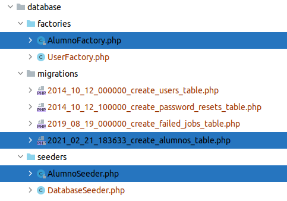
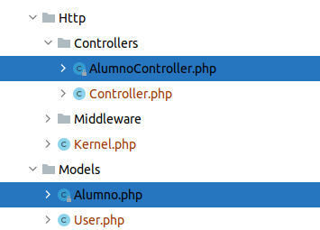
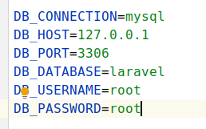
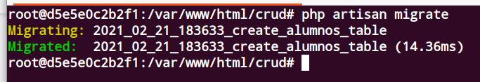
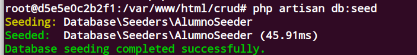
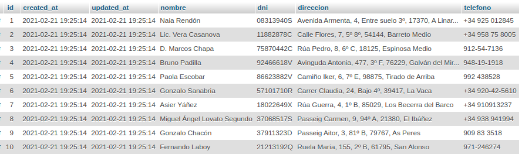
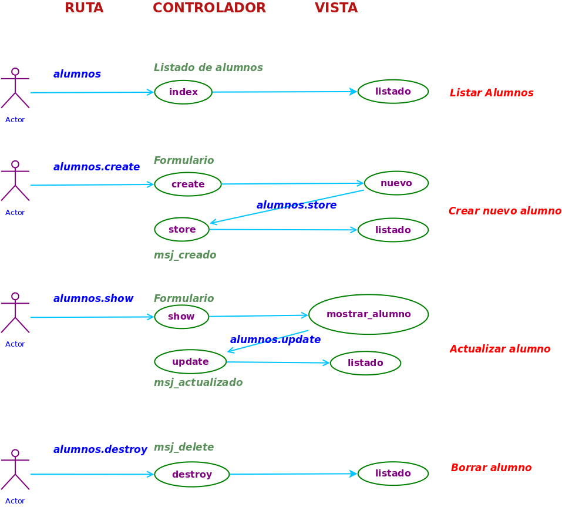
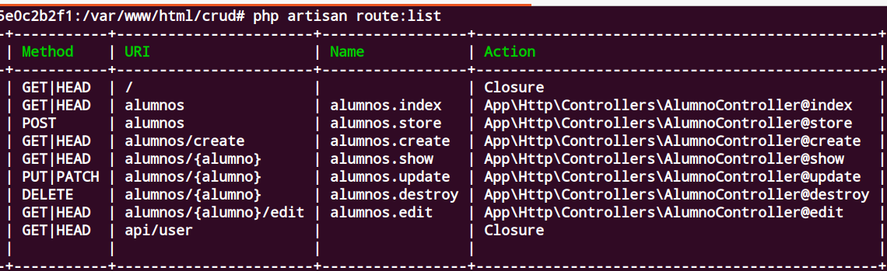

## Hacer un CRUD

Consiste en gestionar una base de datos para realizar operacones sobre una tabla en la base de datos:
1. Crear **Create**
2. Leer **Read**
3. Actualizar **Update**
4. Borrar **Delete**

Vamos a realizar dicho proyecto

Creamos un proyecto en laravel
<pre>
 laravel new crud
</pre> 

Vamos a crear una tabla de alumnos con 4 campos para facilitar su gestión, y la poblaremos con 10 campos.

Sus campos: (los pongo sin acentos)
1. nombre
2. direccion
3. dni
4. telefono

Para gestionar y realizar esto, necesitamos :
1. Una **migración**: para crear la tabla alumnos 
2. Un **factory**: para obetener valores para un alumno  
3. Un **seeder**: para poblar con registros automáticamente a través del factory
4. Un **modelo**: para gestionar la tabla alumnos 
5. Un **controlador**:  para realizar las acciones de programación  
6. Un **enrutamiento** Para realizar solicitudes

### Cremos las clases con artisan

 Podríamos crear cada componente según hemos estudiado, pero podemos hacerlo creando un modelo con todos sus ****acompañantes****
<pre>
php artisan make:model Alumno -a
</pre>

Vemos que ha creado las siguientes clases:
1. **migracion** xxx_create_alumnos_table.php
2. **factories** AlumnosFactory.php
3. **seeders** AlumnoSeeder.php
   
)

4. **Modelo**  Alumno.php
5. **Controlador** AlumnoController.php

)

Respecto a routas y vistas no ha creado nada, procederemos a ello en su momento

### Operativa de crear y poblar la tabla
*Lo primero de todo establecemos las credenciales para conectar con la base de datos.
Esto lo vamos a hacer en el fichero *.env*, recuerda que si no quieres establecer aquí valores, se pueden poner directamente en el fichero de configuración *app/config/database.php*
)

En la primera parte del proyecto vamos a crear y poblar la tabla

Para crear la tabla, primero especificamos en la migración sus campos

En el método **up** de la migración añadimos los campos especificados

<pre>
   public function up()
    {
        Schema::create('alumnos', function (Blueprint $table) {
            $table->id();
            $table->timestamps();
            $table->string("nombre");
            $table->string("dni");
            $table->string("direccion");
            $table->string("telefono");
        });
    }
</pre>";

Ejecutamos la migración y ya tendremos la tabla creada
<pre>
  php artisan migrate
</pre>
)

*Ahora vamos a poblarla.

*Para ello primero vamos a factory y cremos una factoría en el método define de la clase para cada valor del registro
*Recuerda que hay campos para los que no hay que asignar valores, como son el **id, create_at, update_at**. luego volveremos soabre este tema.
<pre>
  public function definition()
    {
        return [
            'nombre' => $this->faker->name,
            'dni' => $this->faker->dni,
            'direccion' => $this->faker->address,
            'telefono' => $this->faker->phoneNumber
            //
        ];
    }
</pre> 

El tema del idioma se resuelve especificando en el fichero de configuración *app.php*, la variable *facker_locale*
<pre>
    'faker_locale' => 'es_ES',
</pre>

*Ahora vamos a invocar a través de seeder la ejecución de esta factoría.
Para ello primero lo invocamos en *AlumnosSeeder.php* cargamos la clase del modelo Alumno con la sentencia *use* e invocamos al método factory del modelo
<pre>
<?php

namespace Database\Seeders;

use Illuminate\Database\Seeder;
use App\Models\Alumno;

class AlumnoSeeder extends Seeder
{
    /**
     * Run the database seeds.
     *
     * @return void
     */
    public function run()
    {
        Alumno::factory()->count(10)->create();
        //
    }
}
</pre>

Antes de ejecutar el seeder, debemos cargarlo en el método *run* de la clase **DatabaseSeeder** donde se cargarán todos
<pre>
 public function run()
    {
        // \App\Models\User::factory(10)->create();
        $this->call(AlumnoSeeder::class);
    }
</pre> 
Y Ahora poblamos la tabla

Vemos la tabla poblada

##Realizando el crud
Ahora vamos a estudiar qué es un crud.
Nosotros queremos realizar sobre la base de datos a través de nuestra aplicación las siguientes acciones:
1. Ver todos los alumnos
2. Añadir un nuevo alumno
3. Editar un alumno, modificar algún valor y guardarlo
4. Borra un alumno concreto

Cada una de estas acciones tiene que tener al menos una entrada en la ruta un una acción en el controlador )

Digo al menos, ya que tanto crear como editar  va a tener dos acciones: primero un formulario para añadir o modificar los datos y luego una acción de guardar dichos datos en la base de datos

Vamos a analizar la siguiente imagen, en la cual incluímos rutas - controladores - vistas

*Cuando tenemos una situación de estas, donde tenemos exactamente estas rutas con estos controladores asociados, se dice que tenemos un **resource**
Laravel permite declarar un *resource* en el fichero de rutas  y lleva asociada estos controladores.

Por lo que nos quedaría es escribir en estos controladores las acciones corrspondientes e invocarlos con nuestras vistas

También tendremos que crear las vistas

Creamos el resource en web.php y vemos como se han creado todos las rutas y controladores

<pre>
Route::resource("alumnos", App\Http\Controllers\AlumnoController::class);
</pre>

Tras insertar esta línea en le route, vemos el resultado de visualizar todas las rutas con el comando de artinsa

<pre>
php artisan route:list
</pre>

Ahora queda implementar cada controlador y cada vista

Para hacerlo un poco más visual, vamos a usar *bootstrap*, por ser el framework que usáis en el ciclo, si bien os invito a que aprendáis *tailwind*

Primero instalamos bootstrap

Para ello sintalamos el paquete *laravel/ui*

<pre>
composer require laravel/ui
</pre>

Y ahora con dicho paquete, desde artisan instalamos bootstrap
<pre>
php artisan ui bootstrap
</pre>

Una vez ejecutado el comando, y siguiendo las instrucciones que nos marcan instalamos con npm los paquetes

<pre>
npm install
npm run dev
</pre>
Ahora vemos que tenemos en nuestra carpeta *public* una carpeta *css* con el fichero **app.css** que contien bootstrap

#### Listar los alumnos
Ante una entrada en la url *http://localhost:8000/alumnos se quiere visualizar a los alumnos

*Escribimos el código en el controlador (fichero index)
Cargamos la clase del modelo, y recuperamos todos los registros que pasamos a la vista a través del array ***alumnos***
<pre>
use App\Models\Alumno;  
......
  public function index()
    {

        $alumnos = Alumno::All();
        return view("alumno.listado",['alumnos'=>$alumnos]);
        //
    }

</pre>
Ahora implementamos la vista

Vamos a crar nuestra vista y la llamamos por ejemplo **listado.blade.php**

https://simplecheatsheet.com/tag/laravel-cheat-sheet/

npm install @fortawesome/fontawesome-free --save

webpack
.copy('node_modules/@fortawesome/fontawesome-free/webfonts', 'public/webfonts')

app.scss
@import '~@fortawesome/fontawesome-free/scss/fontawesome';
@import '~@fortawesome/fontawesome-free/scss/regular';
@import '~@fortawesome/fontawesome-free/scss/solid';
@import '~@fortawesome/fontawesome-free/scss/brands';
# crud-laravel-manuel
# crud-laravel-manuel
# crud-laravel-manuel
# crud-laravel-manuel
